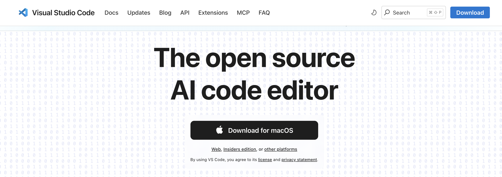
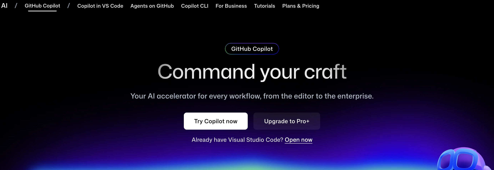
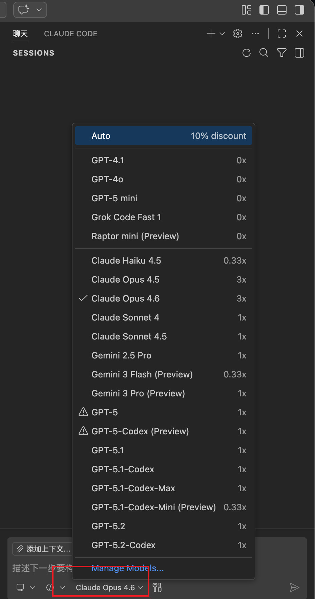

# Agent 工作场景使用指南（一）

本指南将详细介绍如何设置和使用GitHub Copilot Agent功能，帮助大家通过AI助手提升工作效率。

---

## 前置准备

在开始使用Agent功能之前，需要完成以下准备工作：

### 1. 安装VS Code编辑器
VS Code是使用GitHub Copilot的主要开发环境。

访问 [VS Code官方下载页面](https://code.visualstudio.com/) 下载适合的版本并完成安装。

### 2. 订阅GitHub Copilot服务（可选）

GitHub Copilot是一项付费服务，需要订阅后才能使用其全部功能。

访问 [GitHub Copilot功能页面](https://github.com/features/copilot) 了解定价计划并完成订阅。

> **说明：** Copilot订阅为可选项，但对于使用Agent Skills功能是必需的。

---

## 步骤1：在VS Code中安装Copilot扩展

### 1.1 安装GitHub Copilot扩展

在VS Code扩展市场中搜索并安装"GitHub Copilot"扩展。

### 1.2 安装GitHub Copilot Chat扩展

为了使用聊天功能，还需要安装"GitHub Copilot Chat"扩展。

> **提示：** 安装完成后需要使用GitHub账号进行身份验证。

---

## 步骤2：配置和使用Agent功能

### 2.1 选择合适的模型

在Copilot聊天界面中，可以选择不同的AI模型来处理你的任务。

### 2.2 创建任务流

在copilot对话框中选择合适的模型，然后输入你的任务流。

**首次使用建议：**
- 将你的任务拆分成明确的步骤
- 在对话框中逐步输入每个操作
- 观察Agent的执行结果并调整策略

### 2.3 总结为Skills

若Agent执行成功，让Agent把上述过程总结成skills：

1. 请求Agent将成功的操作流程总结为可重用的技能
2. 保存这些skills到你的技能库中
3. 为skills添加描述和使用说明

### 2.4 持续优化

使用skills多次执行细节不同的相同任务：

1. 在不同场景下测试你的skills
2. 让Agent把过程和复盘继续总结进你的skills中
3. 不断打磨skills的准确性和适用性
4. 建立你的专属技能库

---

## 下一篇计划：

开始在实际项目中使用Agent skills功能