# Agent 工作场景使用指南（二）

本文档介绍如何在 VS Code 中配置和使用 GitHub Copilot 的 Agent Skills 功能，使 Copilot 能够加载自定义技能（Skills），完成更专业化的任务。

---

## 前置准备

在开始之前，请确保完成以下准备工作。

### 1. 更新 VS Code 到最新版本

Agent Skills 功能需要较新版本的 VS Code 支持。请前往 [VS Code 官网](https://code.visualstudio.com/) 下载并安装最新版本，或在 VS Code 中通过菜单 **Code → 检查更新** 进行更新。

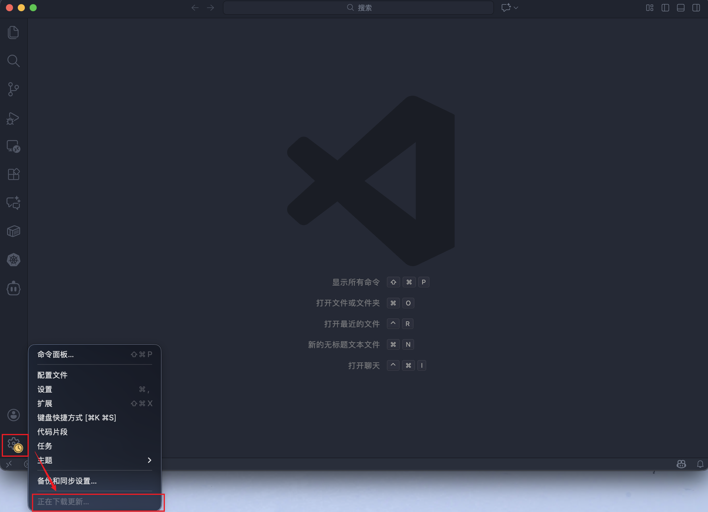

### 2. 安装 GitHub Copilot 扩展

在 VS Code 的扩展市场中搜索 **GitHub Copilot** 并安装：

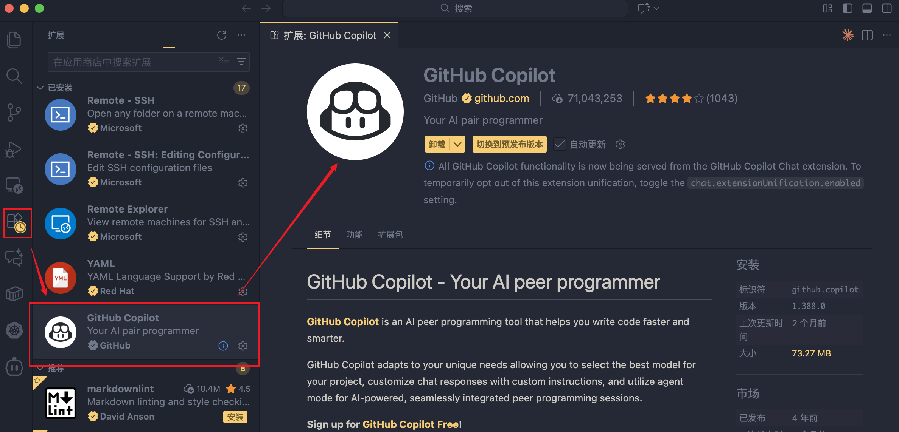

### 3. 安装 GitHub Copilot Chat 扩展

同样在扩展市场中搜索 **GitHub Copilot Chat** 并安装（Agent Skills 依赖 Chat 功能）：

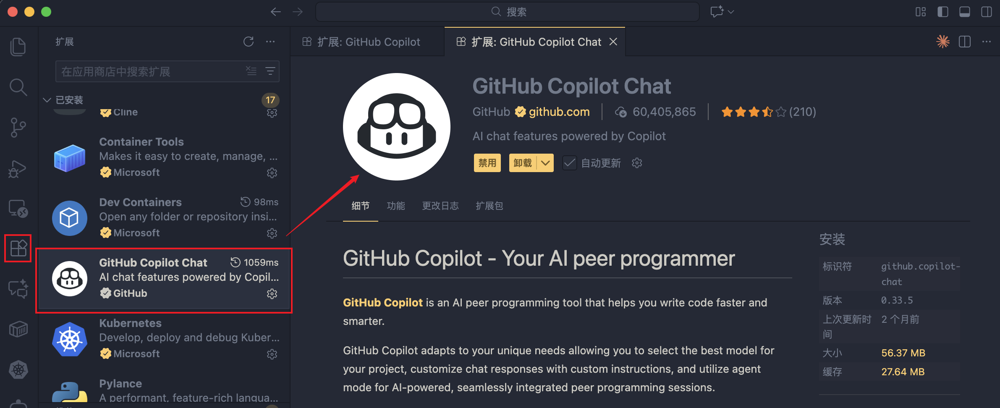

---

## 步骤 1：启用 Agent Skills 设置

点击左下角齿轮图标，在弹出菜单中选择 **设置**。在设置搜索栏中输入 `chat.useAgentSkills`，找到 **Chat: Use Agent Skills** 选项并勾选启用：

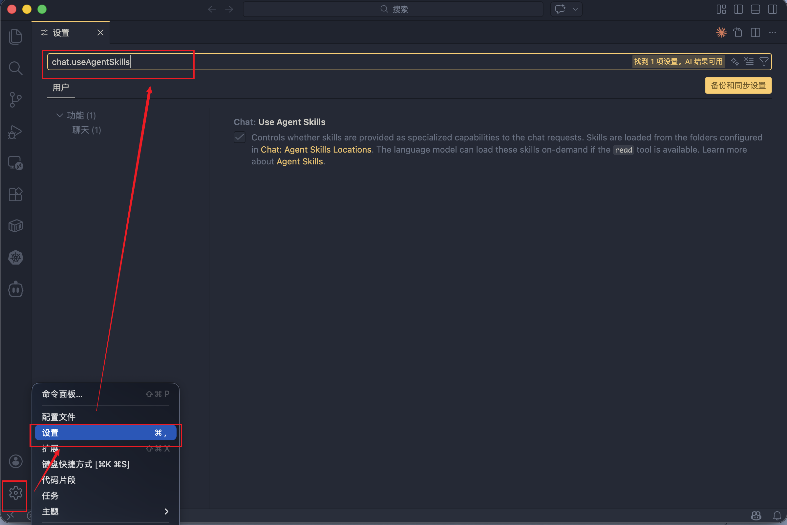

> **说明：** 启用此选项后，Copilot Chat 会将 Skills 作为专业化能力加载。Skills 从 `Chat: Agent Skills Locations` 中配置的文件夹读取，语言模型可以按需加载这些技能。

---

## 步骤 2：下载并配置 Skills

Agent Skills 仓库中包含团队共享的各种技能文件。你需要将它们下载到本地并放置在正确的位置。本文档通过 VS Code 的 Chat 设置面板直接管理 Skills。

#### 2.1 克隆 Agent Skills 仓库

在终端中克隆 Agent Skills 仓库，获取团队共享的 Skill 文件：

```bash
git clone https://github.com/sunshuang1866/agent-skills.git
```

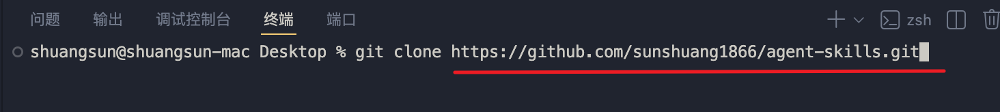

#### 2.2 打开聊天设置中的 Skills 面板

在聊天面板的设置中找到 **Skills** 选项：

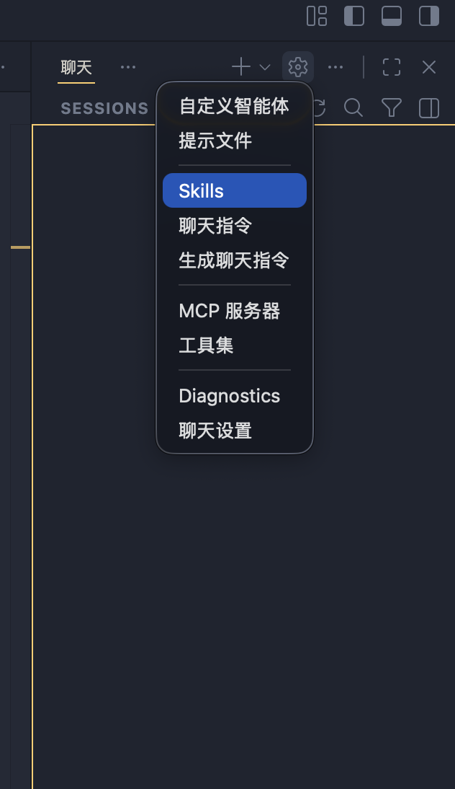

#### 2.3 选择 Skill

从列表中选择要启用的 Skill：

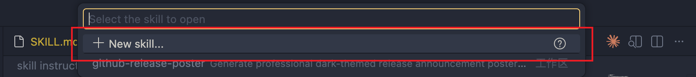

#### 2.4 选择 Skill 存储位置

在弹出的位置选择对话框中，选择 `.github/skills` 作为 Skill 的存储路径：

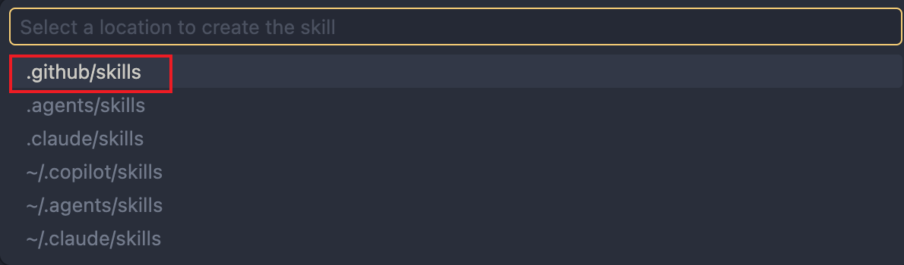

#### 2.5 为智能体命名

输入自定义智能体的名称（例如 `vllm-release-note`），按 **Enter** 确认：

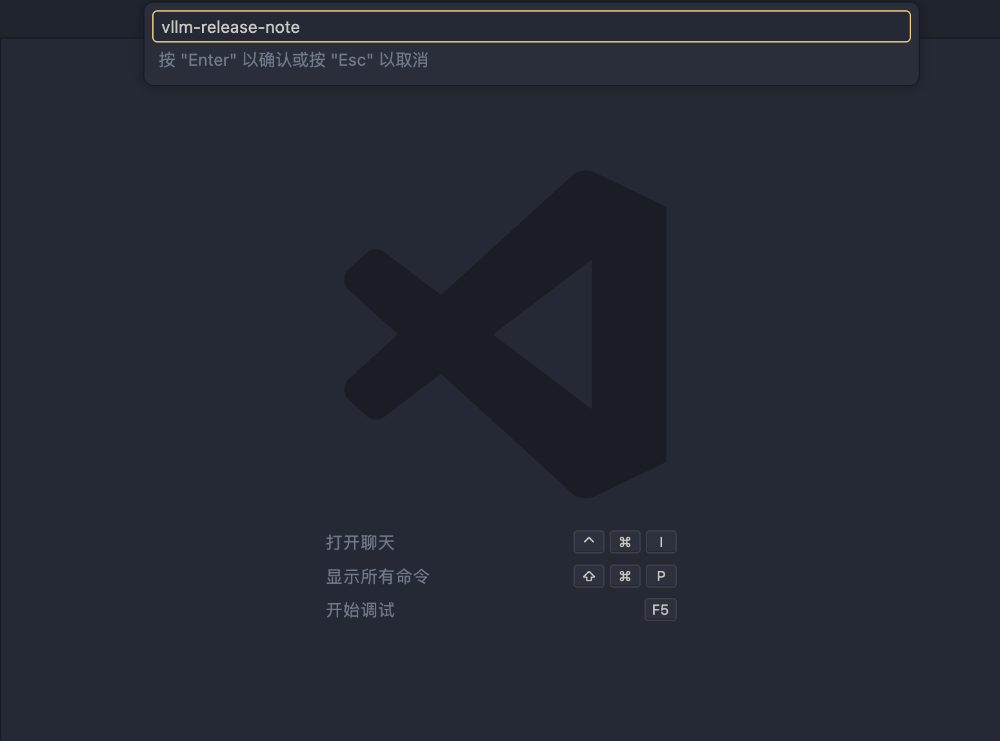


#### 2.6 将 Skill 复制到 `.github/agents` 目录

将所需的 Skill 文件夹（包含 `SKILL.md` 和 `references/` 等内容）复制到你工作空间的 `.github/skills/` 路径下：

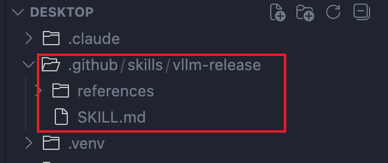


---

## 步骤 3：调用 Skill 执行任务

完成配置后，即可在 Copilot Chat 中调用 Skill 来执行专业化任务。

### 3.1 输入上下文并发送指令

在聊天框中添加上下文信息（如相关网址），并描述你希望 Skill 执行的任务。例如，输入一个 release 页面的 URL，让 Skill 自动生成对应的发布海报：

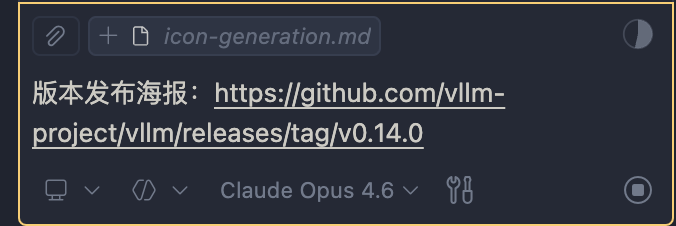

> **示例：** 粘贴 vLLM release 页面链接 `https://github.com/vllm-project/vllm/releases/tag/v0.15.1`，并说明调用skills，Copilot 将根据 Skill 的指令自动生成专业的深色主题发布公告海报。

---
